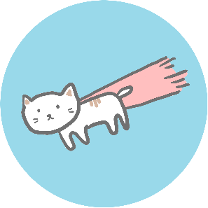

<h1> 갓동빈과 함께하는 코테마스터 오대장</h1> 
<blockquote>코테 마스터를 향한 알고리즘 스터디</blockquote>
  📌 START 2021-01-08 
  📚 Book 이것이 코딩 테스트다
  💻 People 채린, 진수, 동재, 준의, 유라

 
 
 

 
 
 
 

<h2> * January * </h2>

 

|　SUN　|　MON　|　TUE　|　WED　|　THU　|　FRI　|　SAT　|
|:---:|:---:|:---:|:---:|:---:|:---:|:---:|
|           3|            4|           5|           6|           7|            8|           9|
|   |   |   |   |   |ch03 그리디||
| 10 |      11      |      12      |     13     |    14     |     15     | 16 |
|    |ch11 그리디|ch11 그리디|ch04 구현|ch12 구현|ch12 구현|    |
| 17 |      18       |      19       |      20       |     21     |     22     |23|
|    |ch05 DFS/BFS|ch13 DFS/BFS|ch13 DFS/BFS|ch06 정렬|ch14 정렬|  |
| 24 |      25        |       26       |         27              |  28  |  29  |  30  |
|    |ch07 이진탐색|ch15 이진탐색|ch08 다이나믹 프로그래밍|      |      |      |
| 31 |
|    |

 <table style="border: 1px; width:100%; height: 100px; text-align: center;">
	<th>SUN</th>
	<th>MON</th>
    <th>TUE</th>
    <th>WED</th>
    <th>THU</th>
    <th>FRI</th>
    <th>SAT</th>
    <tr><td>10</td><td>11</td><td>12</td><td>13</td><td>14</td><td>15</td><td>16</td></tr>
    <tr>
        <td></td>
        <td>ch11 그리디</td>
        <td>ch11 그리디</td>
        <td>ch04 구현</td>
        <td>ch12 구현</td>
        <td>ch12 구현</td>
        <td></td></tr>
    <tr>
        <td>17</td><td>18</td><td>19</td><td>20</td><td>21</td><td>22</td><td>23</td>
    </tr>
    <tr>
        <td></td>
        <td>ch05 DFS/BFS</td>
        <td>ch13 DFS/BFS</td>
        <td>ch13 DFS/BFS</td>
        <td>ch06 정렬</td>
        <td>ch14 정렬</td>
        <td></td>
    </tr>
    <tr>
        <td>24</td>
        <td>25</td>
        <td>26</td>
        <td>27</td>
        <td>28</td>
        <td>29</td>
        <td>30</td>
    </tr>
        <tr><td></td>
        <td>ch07 이진탐색</td>
        <td>ch15 이진탐색</td>
        <td>ch08 다이나믹 프로그래밍</td>
        <td></td>
        <td></td>
        <td></td>
    </tr>
        <tr><td>31</td>
    </tr>
    <tr>
        <td></td>
    </tr>
</table>
